# Coffee Bean Inventory Management System

## Project Description

This project is a coffee bean inventory management system that allows users to view available coffee beans, add new burlap sacks of beans to the inventory, edit existing inventory, sell pounds of beans, and more.

## Requirements

### Component Tree / Diagram


**[Include the Image or Link to the Component Diagram Here]**

## Features

- View a list of available coffee beans
- Add new burlap sacks of coffee to the inventory
- Edit existing coffee bean details
- Sell pounds of coffee beans
- And more...

## Getting Started

1. Clone the repository:
   ```
   git clone https://github.com/your-username/coffee-bean-inventory.git
   ```

2. Navigate to the project directory:
   ```
   cd coffee-bean-inventory
   ```

3. Install dependencies:
   ```
   npm install
   ```

4. Start the development server:
   ```
   npm start
   ```

5. Open your browser and navigate to `http://localhost:3000`.

## Technologies Used

- React
- PropTypes
- UUID
- Other relevant libraries and tools

## License

[MIT License](LICENSE)